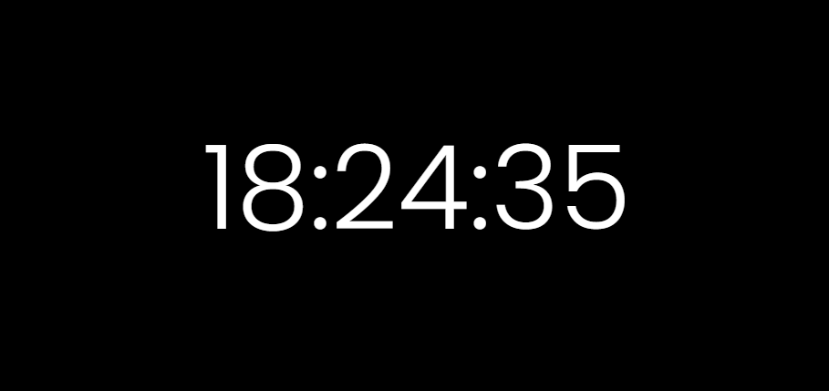

# Relógio Digital

## Descrição do Projeto

O projeto consiste num display simples de relógio digital, onde constam as horas, minutos e segundos. Foi criado no intuito de treinar a funcionalidade do método setInterval() que nos permite executar uma função repetidamente em um espaço de tempo definido. E que precisa de pelo menos dois parâmetros para funcionar. O primeiro é a função que será executada, enquanto o segundo é o tempo em milissegundos em que a função deve se repetir.

## Demonstração
[Link demonstração](https://ffernanda85.github.io/projeto-relogio-digital/)

## Tecnologias Utilizadas

## Pessoas Autoras

[Linkedin Flávia Santos](https://www.linkedin.com/in/flavia-santos-dev/)
